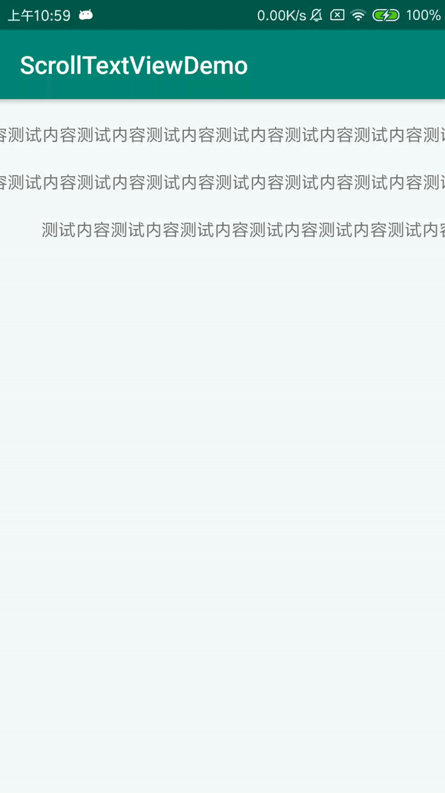

## Android滚动字幕
可配置项：

    String content = "测试内容测试内容测试内容测试内容测试内容测试内容测试内容测试内容测试内容测试内容";
    ScrollTextView scrollTextView1 = findViewById(R.id.scrollTextView1);
    scrollTextView1.setText(content);//设置内容
    scrollTextView1.setSpeed(-3);//设置速度，小于0向左，大于0向右
    scrollTextView1.setFPS(100);//设置每秒刷新次数
    scrollTextView1.startScroll();//开始滚动
## Demo 图片
